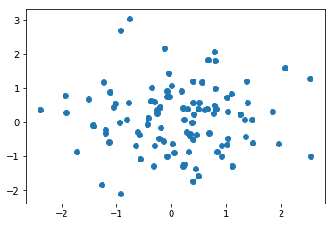
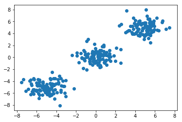
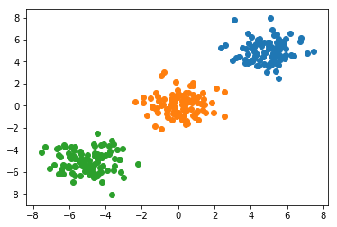

```python
import numpy as np
import scipy.cluster
import matplotlib.pyplot as plt

a = np.random.multivariate_normal([0,0],[[1.0,0.0],[0.0,1.0]],100)#正規分布に従う点(原点が中心)

plt.scatter(a[:,0],a[:,1])
plt.savefig("figure3.png")
```





```python
b = np.random.multivariate_normal([-5,-5],[[1.0,0.0],[0.0,1.0]],100)#正規分布に従う点([-5,-5]が中心)
c = np.random.multivariate_normal([5,5],[[1.0,0.0],[0.0,1.0]],100)#正規分布に従う点([5,5]が中心)

src = np.vstack((a,b,c))
plt.scatter(src[:,0],src[:,1])
plt.savefig("figure4.png")

```





```python
#K-means法
codebook,distortion = scipy.cluster.vq.kmeans(src,3)#k-means法

code,dist = scipy.cluster.vq.vq(src,codebook)

da = [src[i] for i in np.where(code==0)][0]
db = [src[i] for i in np.where(code==1)][0]
dc = [src[i] for i in np.where(code==2)][0]

plt.scatter(da[:,0],da[:,1])
plt.scatter(db[:,0],db[:,1])
plt.scatter(dc[:,0],dc[:,1])
plt.savefig("figure5.png")
```




