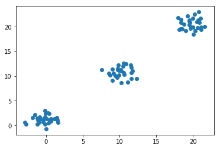
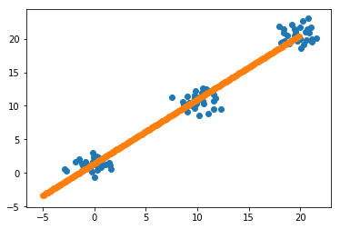

```python
import numpy as np
import scipy.cluster
import matplotlib.pyplot as plt
g1 = np.random.multivariate_normal([0,1],[[1.0,0.0],[0.0,1.0]],30)
g2 = np.random.multivariate_normal([10,11],[[1.0,0.0],[0.0,1.0]],30)
g3 = np.random.multivariate_normal([20,21],[[1.0,0.0],[0.0,1.0]],30)

g = np.vstack((g1,g2,g3))
plt.scatter(g[:,0],g[:,1])
plt.savefig("figure6.png")
```





```python
import scipy.stats
line = scipy.stats.linregress(g[:,0],g[:,1])
print(line)
```

    LinregressResult(slope=0.9544589008669605, intercept=1.4096466844889814, rvalue=0.9846736839543307, pvalue=1.5581327231877459e-68, stderr=0.018021337040570413)


```python
plt.scatter(g[:,0],g[:,1])
x = np.arange(-5,20,0.1)
y = line.slope*x+line.intercept
plt.scatter(x,y)
plt.savefig("figure7.png")
```



