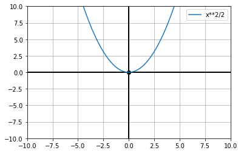

```python
import matplotlib.pyplot as plt
import numpy as np
import sympy as sp

Pi = sp.S.Pi # 円周率
E = sp.S.Exp1 # 自然対数の底
I = sp.S.ImaginaryUnit # 虚数単位

def reset(data):
    print("setting:reset")
    for n in range(len(data)):
        data[n] = int(input(data[n]+">>"))

def usedefult():
    print("setting:defult")
    plt.axis([-10,10,-10,10])

def setting():
    print("グラフの設定をしますか？")
    if input("[yes/no]") == "yes":
        axis_name = ["xmin","xmax","ymin","ymax"]
        reset(axis_name)
        plt.axis(axis_name)
    else:
        usedefult()
    plt.axhline(0,c='black',lw=2)
    plt.axvline(0,c='black',lw=2)
    plt.plot(0,0,'o',c='black')
    plt.grid()

def plot(x_min=-10,x_max=10.1,kankaku=0.1):
    x = sp.Symbol('x')
    f = sp.sympify(input("f>>"))
    y = []
    x_ = np.arange(x_min,x_max,kankaku)
    for i in x_:
        f_ = f.subs(x,i)
        y.append(f_)
    plt.plot(x_,y,label=f)
    plt.legend()
    plt.show()
try:
    setting()
    plot()
except:
    print("ERROR")
```

    グラフの設定をしますか？
    [yes/no]o
    setting:defult
    f>>(1/2)*x**2



