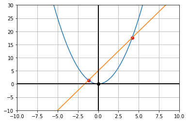

`Python`
```python
import matplotlib.pyplot as plt
import numpy as np
import sympy as sp

x = sp.Symbol('x')
y = sp.Symbol('y')
#-----------------------------
f = sp.sympify(input("f>>"))
g = sp.sympify(input("g>>"))
#----------------------------
an = sp.solve([f-y,g-y],[x,y])
an0=an[0]
an1=an[1]
plt.plot(an0[0],an0[1],'o',color='r')
plt.plot(an1[0],an1[1],'o',color='r')
print("\n"+str(an0)+"\n=================")
print(an1)
#-------------------------------

min=-10
max=10

#-------------------------------
x_ = np.arange(min, max, 0.1)
y = []
y_ = []
for i in x_:
    y.append(f.subs(x, i))
    y_.append(g.subs(x, i))
plt.plot(x_, y)
plt.plot(x_, y_)
plt.axhline(0,c='black',lw=2)
plt.axvline(0,c='black',lw=2)
plt.plot(0,0,'o',color='black')
plt.xlim([min,max])
plt.ylim([-10,30])
plt.grid()
plt.show()
```

    f>>x**2
    g>>3*x+5

    (3/2 + sqrt(29)/2, 3*sqrt(29)/2 + 19/2)
    =================
    (-sqrt(29)/2 + 3/2, -3*sqrt(29)/2 + 19/2)



